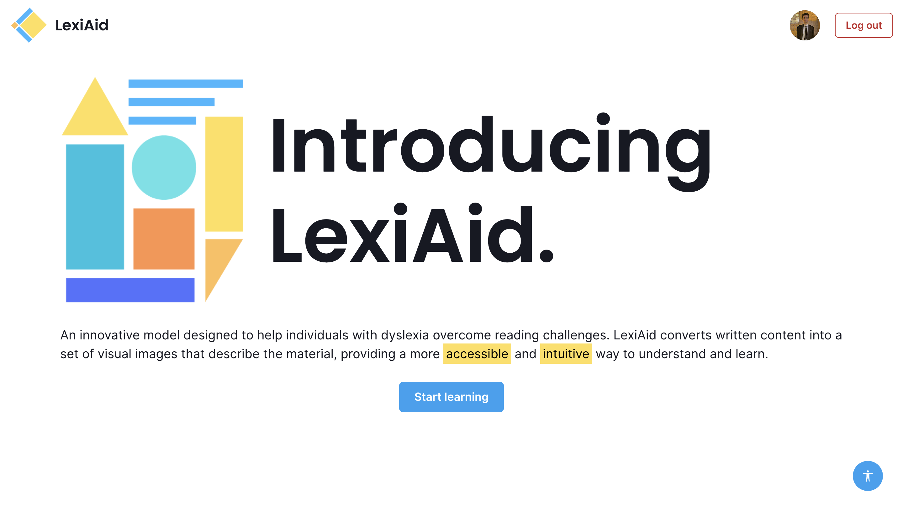
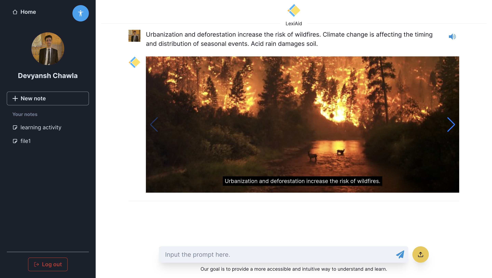
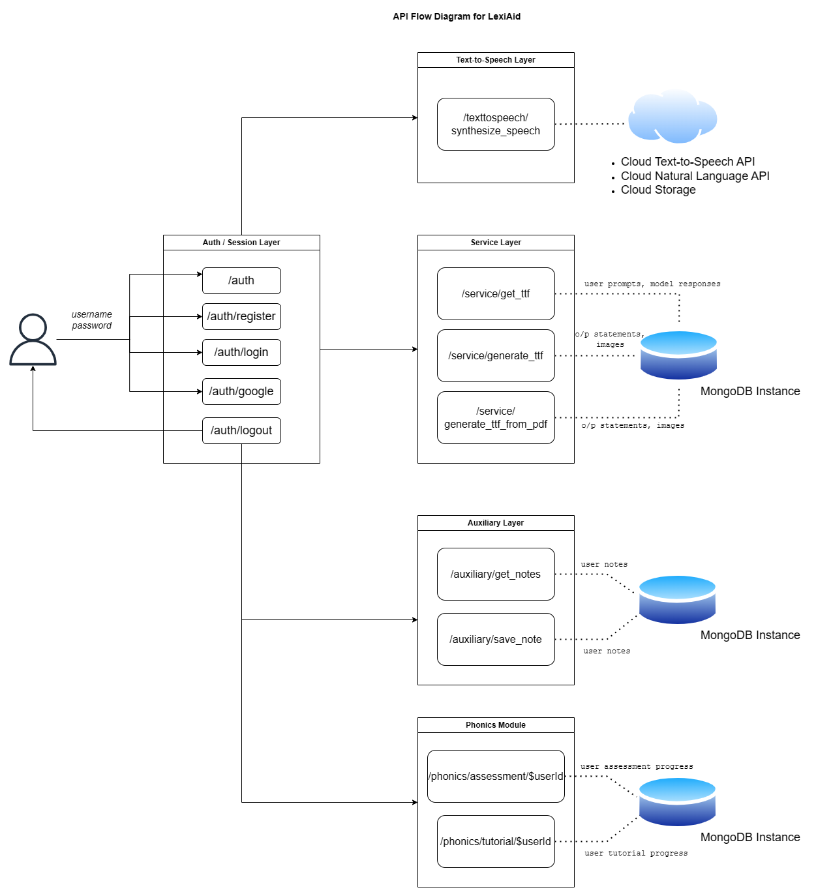

# LexiAid: Learning Aid for Dyslexic Students

LexiAid is a learning aid for dyslexic students at the elementary school level that uses a multimodal approach to learning to provide a more accessible and intuitive way to understand and learn.

It has the following features:
- Text-to-Figure (TTF Module): Generates a set of contextually coherent images/figures.

- Phonics module: It is a training module consisting of lessons and gamified learning track for phonics. The interface is designed keeping in mind the balance between ease of use and progressive complexity.

- Accessibility features: These are features important for accessibility and include dyslexic-friendly text-background colour combination and font style along with adjustable font size. Extra spacing has also been used for displaying the text within the application.

- Immersive reader: Document text-to-speech reader with customisable speech options like reader, speed.

- Voice assisted note-taker: Component to take notes without typing using speech-to-text technology. Input to the microphone is converted to text, enabling ease of access.

## API Flow Diagram
The web interface makes API calls to the Flask backend. The core contribution can be discussed in two parts: the machine learning model responsible for Text-to-Feature (TTF) functionality integrated with the web application.

## How to run locally

### Running the backend:
1. `cd` into the `/backend` directory.
2. Create a virtual environment using `python3 -m venv venv`.
3. Activate the virtual env using `. venv/bin/activate`.
4. Install the required dependencies using `pip install -r requirements.txt`.
5. Run the flask server using `flask --app flaskbackend run`. Use the **--debug** flag for debugging options.

### Running the frontend:
1. `cd` into the `/frontend` directory.
2. Install the required dependencies using `npm install`.
3. Run `npm start`. Your app should be made available on `localhost:3000`.
